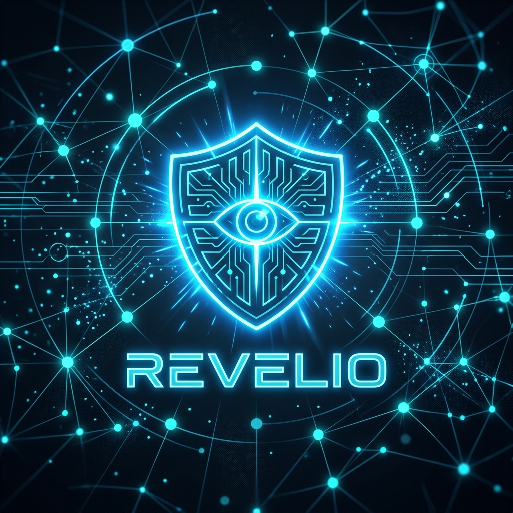

<div align="center">
  

  <br/>

  [](https://github.com/DiptanshuDhawan/Revelio)
  [](https://opensource.org/licenses/MIT)
  [](#)
</div>

---

## 🚀 The Dual-Engine Architecture

Traditional email security gateways fail against zero-day social engineering and AI-generated phishing. **Revelio** solves this by bringing SOC-level, dual-engine analysis directly into your browser.

<div align="center">
  
</div>

<details>
<summary><b>🔍 How the scoring works (Click to expand)</b></summary>
<br/>

Revelio scores threats from `0` to `100` using a proprietary algorithm:
1. **Deterministic Rule Engine (40%):** Runs 12 strict heuristics instantly (Header Auth, URL Lookalikes, Payload Scans).
2. **Deep-Context LLM (60%):** Evaluates the psychological elements of the email (Fabricated Urgency, Authority Manipulation, AI-generated Syntax).

</details>

---

## ⚡ Core Features

<div align="center">
  <table>
    <tr>
      <td align="center">🛡️<br/><b>Header Forensics</b><br/>Instant verification of SPF, DKIM, and DMARC alignment.</td>
      <td align="center">🕵️<br/><b>URL Deobfuscation</b><br/>Detects lookalike domains (<code>paypaI.com</code>) and unmasks shorteners.</td>
      <td align="center">🤖<br/><b>Impersonation AI</b><br/>Spots when display names contradict the true envelope sender.</td>
    </tr>
    <tr>
      <td align="center">💸<br/><b>Financial Fraud</b><br/>Identifies invoice manipulation and payroll diversion attempts.</td>
      <td align="center">🔒<br/><b>Local Privacy</b><br/>Supports 100% offline analysis via Ollama. No data leaks.</td>
      <td align="center">📊<br/><b>SOC Reports</b><br/>Generates printable, MITRE-mapped threat intelligence reports.</td>
    </tr>
  </table>
</div>

---

<details>
<summary><b>🛠️ Quick Start & Installation (Click to expand)</b></summary>
<br/>

### 1. Install Extension
1. Clone this repository.
2. Go to `chrome://extensions/` in Chrome.
3. Enable **Developer Mode**.
4. Click **Load unpacked** and select the `/phishguard-ai` folder.

### 2. Configure Local AI (Recommended for 100% Privacy)
```bash
# Install Ollama (https://ollama.ai) and pull the recommended reasoning model
ollama pull deepseek-r1:8b

# Start the server with CORS enabled
OLLAMA_ORIGINS=chrome-extension://* ollama serve
```

</details>

<details>
<summary><b>🤝 For Security Researchers (Click to expand)</b></summary>
<br/>

Revelio is built to be easily extensible for SOC environments:
* 🧩 **Rules:** Add custom deterministic triggers in `engine/ruleEngine.js`.
* 🧠 **Prompts:** Tweak BEC detection chains in `engine/prompts.js`.

</details>

---

<p align="center">
  <i>Built for security professionals who need fast, accurate phishing detection without sacrificing privacy.</i>
</p>
