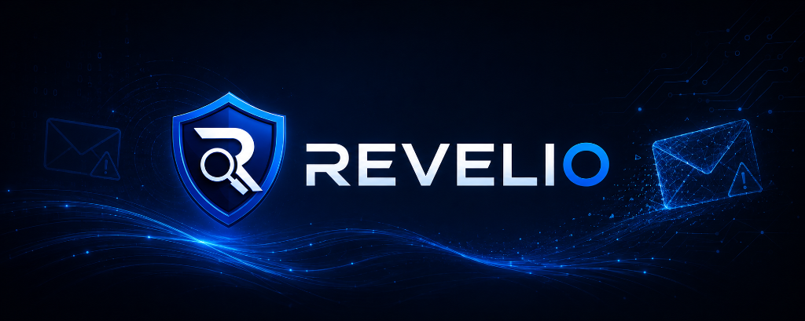
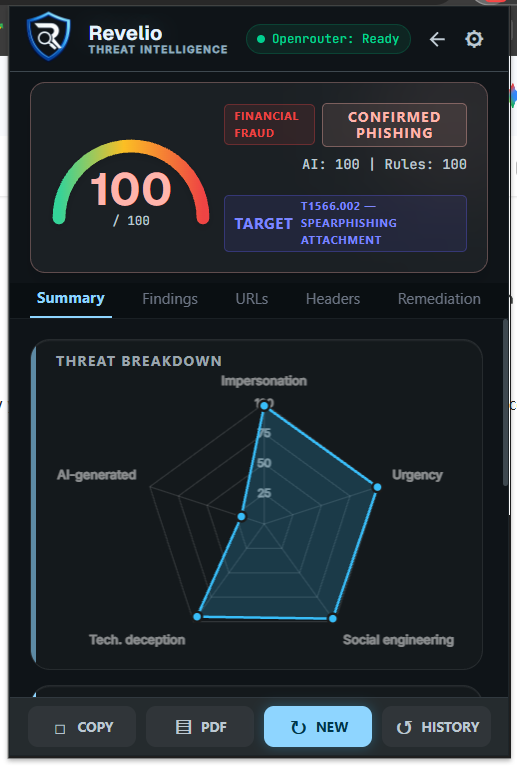
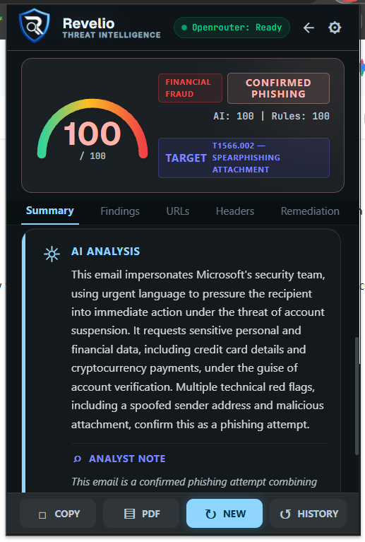
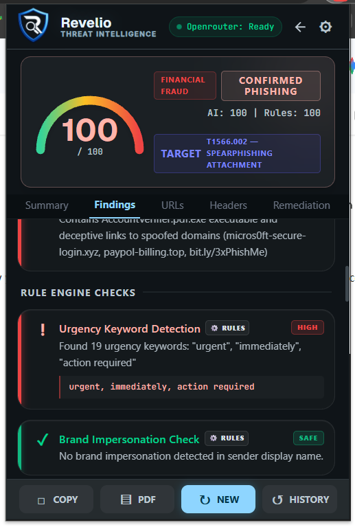
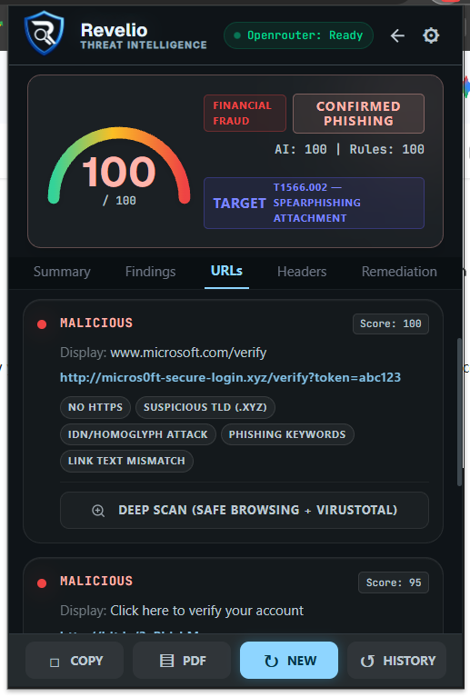
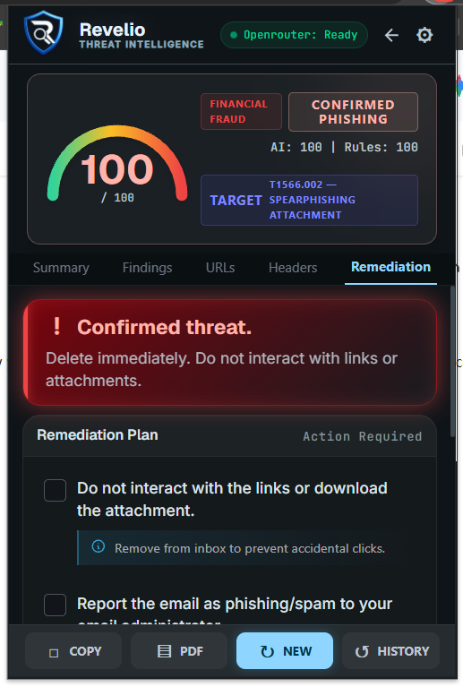
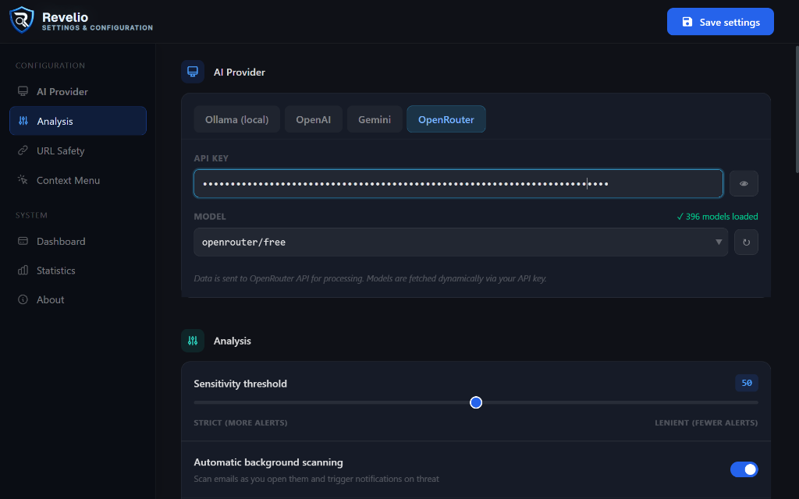
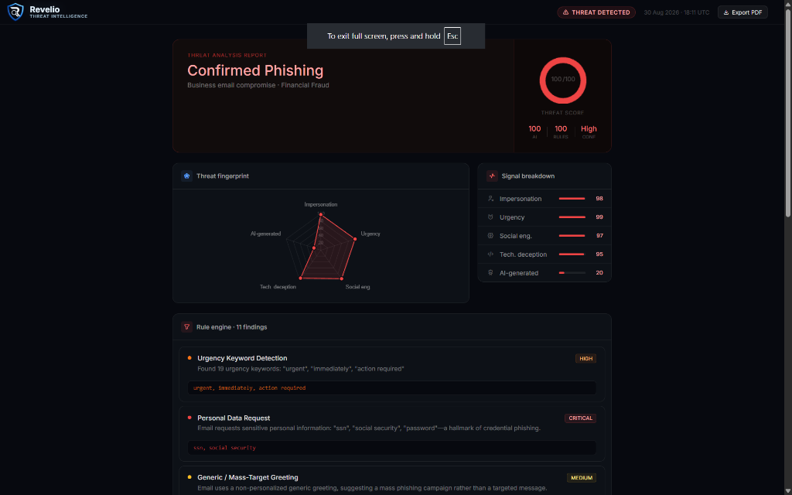
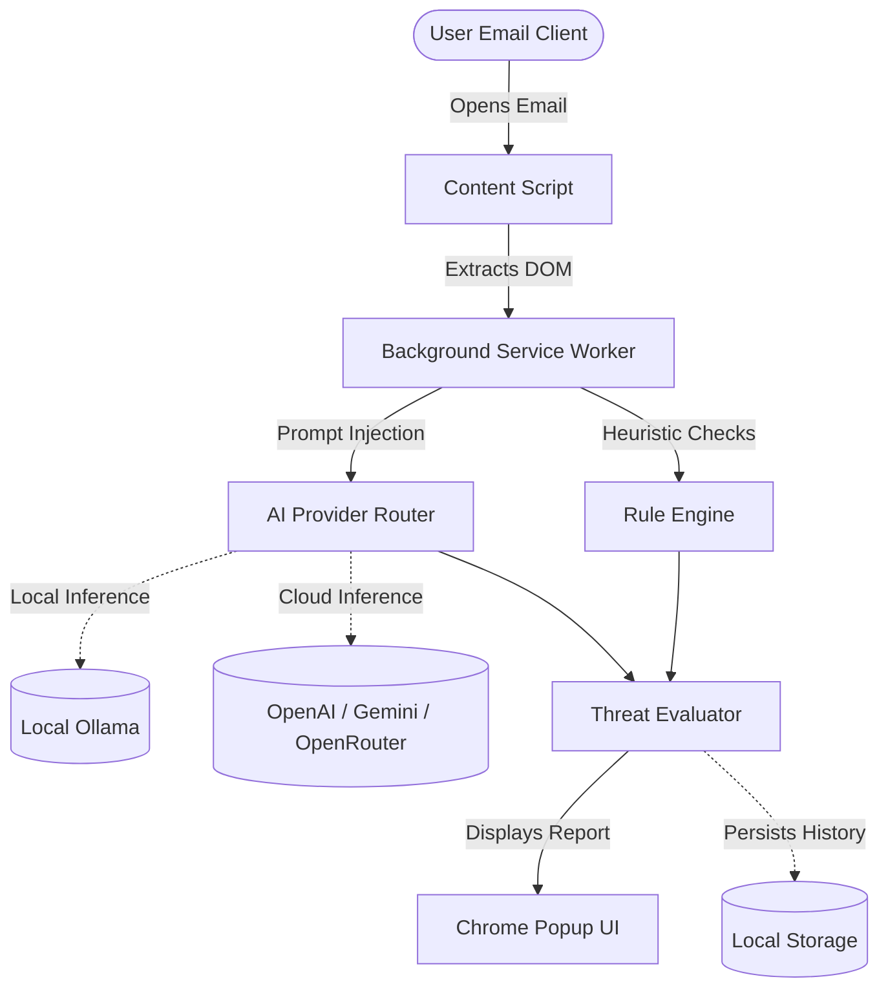

<div align="center">
  

  <p>
    <a href="https://developer.chrome.com/docs/extensions/"></a>
    <a href="https://developer.mozilla.org/en-US/docs/Web/JavaScript"></a>
    <a href="https://tailwindcss.com/"></a>
    <a href="https://github.com/DiptanshuDhawan/Revelio/commits/main"></a>
    <a href="https://github.com/DiptanshuDhawan/Revelio/commits/main"></a>
    <br>
    <a href="https://github.com/DiptanshuDhawan/Revelio"></a>
    <a href="https://github.com/DiptanshuDhawan/Revelio"></a>
    <a href="https://github.com/DiptanshuDhawan/Revelio"></a>
    <a href="#license"></a>
    <a href="https://github.com/DiptanshuDhawan/Revelio/pulls"></a>
    <a href="#project-status"></a>
  </p>
</div>

---

## Features & Interface

### Threat Intelligence Dashboard
The extension popup provides a complete breakdown of the analyzed email, including a Threat Radar, MITRE ATT&CK mapping, and specific AI-driven findings.

<div align="center">
  &nbsp;
  &nbsp;
  
  <br><br>
  &nbsp;&nbsp;&nbsp;&nbsp;&nbsp;
  
</div>

### Extensive Configuration
Revelio offers a comprehensive settings panel where you can seamlessly switch between local (Ollama) and cloud AI providers, configure URL safety checks (Google Safe Browsing & VirusTotal), and adjust sensitivity thresholds.

<div align="center">
  
</div>

### PDF Report Generation
Generate SOC-ready PDF reports with a single click to document and escalate confirmed threats.

<div align="center">
  
</div>

---

Traditional Secure Email Gateways often miss zero-day social engineering and targeted Business Email Compromise (BEC) attacks. Revelio solves this by bringing enterprise-grade, AI-driven threat analysis directly into your browser. 

- **Dual-Engine Architecture**: Combines lightning-fast deterministic heuristics (URL lookalikes, header spoofing) with deep-context Large Language Models (evaluating urgency, manipulation, and tone).
- **Zero-Trust Privacy**: Supports 100% offline analysis via Ollama. No sensitive email data ever leaves your machine unless you explicitly configure a cloud provider.
- **Dynamic AI Integrations**: Plugs seamlessly into local models (Ollama) or leading cloud providers (OpenAI, Google Gemini, OpenRouter) with automatic, dynamic model discovery.
- **Passive Auto-Scan**: Scans emails seamlessly in the background the moment you open them, generating MITRE-mapped threat intelligence reports.

## Architecture

Revelio operates entirely within the browser using Manifest V3 architecture.



## Quick Start

### Prerequisites

- Google Chrome, Microsoft Edge, or any Chromium-based browser
- Node.js & npm (for building CSS)
- **(Optional)** [Ollama](https://ollama.com/) for fully offline, zero-trust local analysis

### 1. Clone the repository

```bash
git clone https://github.com/DiptanshuDhawan/Revelio.git
cd Revelio
```

### 2. Build the styles

Revelio uses Tailwind CSS. Install dependencies and compile the stylesheet:

```bash
npm install
npm run build:css
```

### 3. Load the extension

1. Open your browser and navigate to `chrome://extensions/`.
2. Enable **Developer mode** using the toggle in the top right corner.
3. Click **Load unpacked** and select the `Revelio` directory.

### 4. Configure AI Providers (Settings)

Click the Revelio extension icon, open the **Settings**, and navigate to the **AI Provider** tab:
- **Local (Ollama)**: Ensure Ollama is running with CORS enabled:
  ```bash
  OLLAMA_ORIGINS="chrome-extension://*" ollama serve
  ```
- **Cloud**: Input your API key for OpenAI, Gemini, or OpenRouter. Available models are fetched dynamically.

## Development & Contributing

Please see [CONTRIBUTING.md](CONTRIBUTING.md) for details on setting up the dev environment and our coding standards. 

## Project Status

Revelio is currently in active beta. The core heuristic engine, popup UI, dynamic AI provider system, and background orchestration are fully functional. Current work focuses on expanding deterministic rules and refining LLM prompts for newer models.

## License

Distributed under the MIT License. See `LICENSE` for details.
