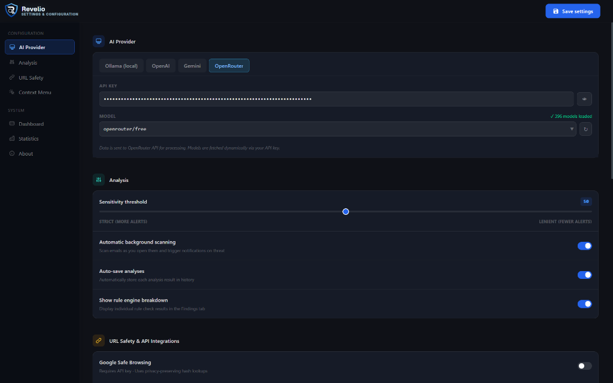

  
  <h1>REVELIO</h1>
  
<strong>Advanced Threat Intelligence & Phishing Analysis</strong>

  

    
    
    
    
    
     
    
    
    
    
    
    
  

---

## Overview

  
  &nbsp;&nbsp;&nbsp;&nbsp;
  

Traditional Secure Email Gateways often miss zero-day social engineering and targeted Business Email Compromise (BEC) attacks. Revelio solves this by bringing enterprise-grade, AI-driven threat analysis directly into your browser. 

- **Dual-Engine Architecture**: Combines lightning-fast deterministic heuristics (URL lookalikes, header spoofing) with deep-context Large Language Models (evaluating urgency, manipulation, and tone).
- **Zero-Trust Privacy**: Supports 100% offline analysis via Ollama. No sensitive email data ever leaves your machine unless you explicitly configure a cloud provider.
- **Dynamic AI Integrations**: Plugs seamlessly into local models (Ollama) or leading cloud providers (OpenAI, Google Gemini, OpenRouter) with automatic, dynamic model discovery.
- **Passive Auto-Scan**: Scans emails seamlessly in the background the moment you open them, generating MITRE-mapped threat intelligence reports.

## Architecture

Revelio operates entirely within the browser using Manifest V3 architecture.

\\\mermaid
graph TD
    User([User Email Client]) -->|Opens Email| Content[Content Script]
    
    Content -->|Extracts DOM| Worker[Background Service Worker]
    
    Worker -->|Heuristic Checks| Rules[Rule Engine]
    Worker -->|Prompt Injection| AI[AI Provider Router]
    
    AI -.->|Local Inference| Ollama[(Local Ollama)]
    AI -.->|Cloud Inference| Cloud[(OpenAI / Gemini / OpenRouter)]
    
    Rules --> Evaluator[Threat Evaluator]
    AI --> Evaluator
    
    Evaluator -->|Displays Report| Popup[Chrome Popup UI]
    Evaluator -.->|Persists History| Storage[(Local Storage)]
\\\

## Quick Start

### Prerequisites

- Google Chrome, Microsoft Edge, or a Chromium-based browser
- Node.js (for compiling Tailwind CSS)
- **(Optional)** [Ollama](https://ollama.com/) for fully offline, zero-trust local analysis.

### 1. Clone the repository

\\\ash
git clone https://github.com/DiptanshuDhawan/Revelio.git
cd Revelio
\\\

### 2. Build the styles

Revelio uses Tailwind CSS. Install the dependencies and compile the popup styling:

\\\ash
npm install
npm run build:css
\\\

### 3. Load the extension

1. Open your browser and navigate to chrome://extensions/.
2. Enable **Developer mode** using the toggle in the top right corner.
3. Click **Load unpacked** and select the Revelio folder you just cloned.

### 4. Configure AI Providers (Settings)

Click the Revelio extension icon, open the **Settings**, and navigate to the **AI Provider** tab.
- **Local (Ollama)**: Ensure your Ollama server is running with CORS enabled (\OLLAMA_ORIGINS="chrome-extension://*" ollama serve\).
- **Cloud**: Input your API key for OpenAI, Gemini, or OpenRouter. The extension will automatically fetch and display available models.

## Development & Contributing

Please see [CONTRIBUTING.md](CONTRIBUTING.md) for details on setting up the dev environment and our coding standards. 

## Project Status

Revelio is currently in active beta. The core heuristic engine, popup UI, dynamic AI provider system, and background orchestration are fully functional. Current work focuses on expanding deterministic rules and refining LLM prompts for newer models.

## License

Distributed under the MIT License. See \LICENSE\ for details.
