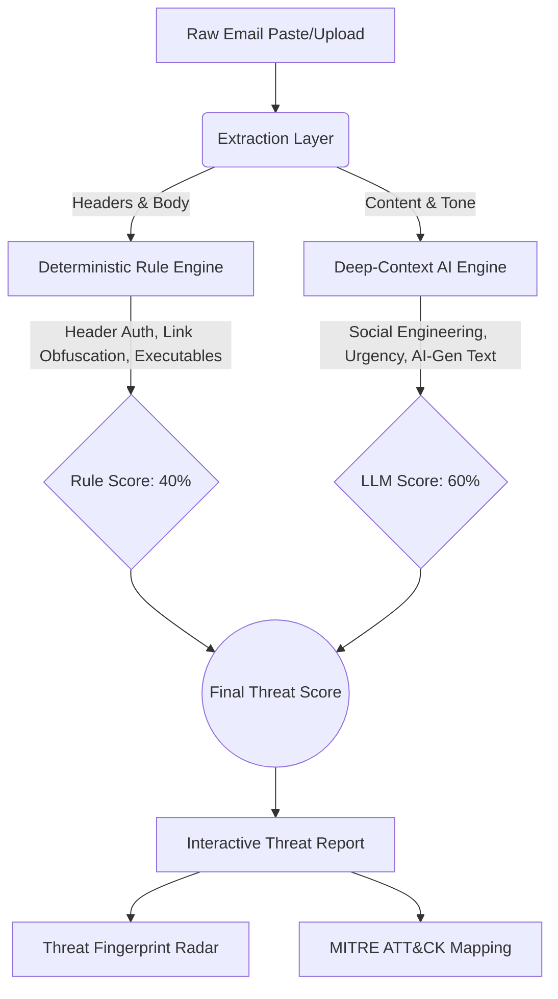

<div align="center">
  
  <h1>🛡️ Revelio: Advanced Threat Intelligence</h1>
  <p><strong>Next-Gen, AI-Powered Email Security & Phishing Analysis for SOC Teams</strong></p>

  [](https://github.com/DiptanshuDhawan/Revelio)
  [](https://opensource.org/licenses/MIT)
  [](#)
</div>

---

## 🚀 Why Revelio?

Traditional email security gateways fail against zero-day social engineering and AI-generated phishing. **Revelio** brings SOC-level analysis directly into your browser. 

<div align="center">
  <table>
    <tr>
      <td align="center">🛡️<br/><b>Dual-Engine Defense</b><br/>Combines 12 deterministic heuristic checks with deep LLM contextual analysis.</td>
      <td align="center">🔒<br/><b>Zero-Trust Privacy</b><br/>Supports 100% local AI via Ollama. No sensitive email data leaves your machine.</td>
      <td align="center">📊<br/><b>Enterprise Reports</b><br/>Generates printable, MITRE-mapped threat intelligence reports in milliseconds.</td>
    </tr>
  </table>
</div>

---

## 🧠 The Architecture

Revelio scores threats from `0` to `100` using a proprietary weighted algorithm that heavily reduces false positives while catching zero-day BEC (Business Email Compromise).



---

## ⚡ Core Capabilities

| Feature | Description |
|---------|-------------|
| **Header Forensics** | Instant verification of SPF, DKIM, and DMARC alignment. |
| **URL Deobfuscation** | Detects lookalike domains (`paypaI.com`) and unmasks URL shorteners. |
| **Impersonation AI** | Spots when "CEO John Doe" contradicts the actual SMTP envelope sender. |
| **Financial Fraud** | Identifies invoice manipulation, payroll diversion, and wire requests. |
| **Scan History** | Persistent local storage to audit and review past threat analyses. |

---

## 🛠️ Quick Start

### 1. Install Extension
1. Clone this repository.
2. Go to `chrome://extensions/` in Chrome.
3. Enable **Developer Mode**.
4. Click **Load unpacked** and select the `/phishguard-ai` folder.

### 2. Configure Local AI (Optional but Recommended)
Run Revelio completely offline to ensure maximum privacy:
```bash
# 1. Install Ollama (https://ollama.ai)
# 2. Pull a reasoning model
ollama pull deepseek-r1:8b

# 3. Start the server with CORS enabled
OLLAMA_ORIGINS=chrome-extension://* ollama serve
```
*(Cloud fallback options via OpenAI API and Google Gemini are also natively supported).*

---

## 🤝 For Security Researchers

Revelio is built to be extensible for SOC environments:
* 🧩 **Rules:** Add custom deterministic triggers in `engine/ruleEngine.js`.
* 🧠 **Prompts:** Tweak BEC detection chains in `engine/prompts.js`.

<p align="center">
  <i>Built for security professionals who need fast, accurate phishing detection without sacrificing privacy.</i><br/>
  <b>MIT License</b>
</p>
